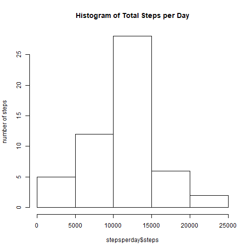
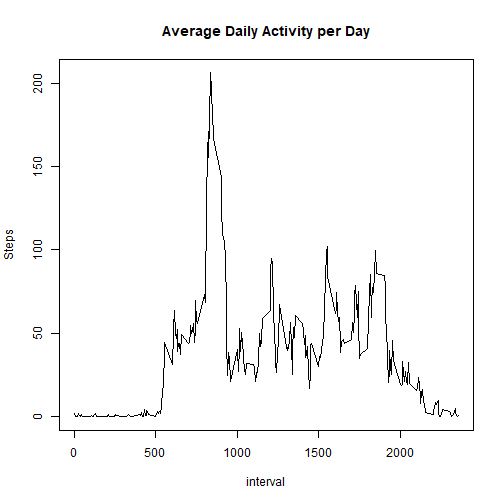
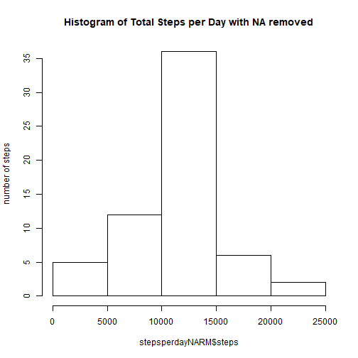
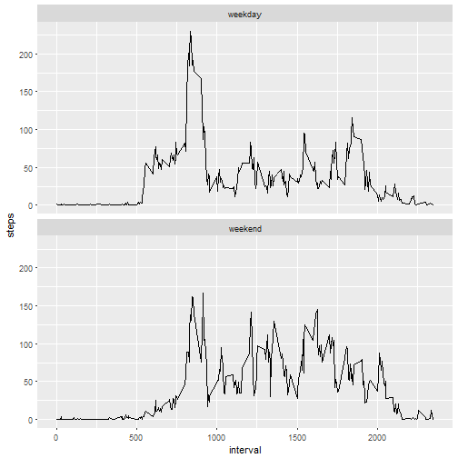

```r
---
title: "Week2RMarkdown"
author: "Thazin"
date: "June 25, 2017"
output: html_document
---
```

```
## Error: <text>:7:0: unexpected end of input
## 5: output: html_document
## 6: ---
##   ^
```

# Week2 R Markdown Coursera Assignment

Loading and preprocessing the data

Load the data (i.e. read.csv())
Process/transform the data (if necessary) into a format suitable for your analysis


```r
act <- read.csv("activity.csv",header=TRUE)
```

## What is mean total number of steps taken per day?

For this part of the assignment, you can ignore the missing values in the dataset.

Calculate the total number of steps taken per day 


```r
stepsperday <- aggregate(steps ~ date,act, sum, na.action = na.omit)
```

Make a histogram of the total number of steps taken each day 


```r
hist(x=stepsperday$steps, ylab="number of steps", main="Histogram of Total Steps per Day")
```




Calculate and report the mean and median of the total number of steps taken per day

```r
summary(stepsperday$steps)
```

```
##    Min. 1st Qu.  Median    Mean 3rd Qu.    Max. 
##      41    8841   10760   10770   13290   21190
```

What is the average daily activity pattern?
Make a time series plot (i.e. type = "l") of the 5-minute interval (x-axis) and 
the average number of steps taken, averaged across all days (y-axis)


```r
avgdailysteps <- aggregate(steps ~ interval,act, mean, na.action = na.omit)
```




Which 5-minute interval, on average across all the days in the dataset, contains the maximum number of steps?

```r
avgdailysteps[which.max(avgdailysteps[,2]),1]
```

```
## [1] 835
```

#Inputing missing values

Note that there are a number of days/intervals where there are missing values (coded as NA). The presence of missing days may introduce bias into some calculations or summaries of the data.

Calculate and report the total number of missing values in the dataset (i.e. the total number of rows with NAs)


```r
sum(is.na(act$steps))
```

```
## [1] 2304
```

Devise a strategy for filling in all of the missing values in the dataset. The strategy does not need to be sophisticated. For example, you could use the mean/median for that day, or the mean for that 5-minute interval, etc.


```r
actNARM <- act

for (n in 1:nrow(actNARM)){
  if (is.na(actNARM$steps[n])){
    actNARM$steps[n] = avgdailysteps[which(avgdailysteps$interval==actNARM$interval[n]),2]
  }
}
stepsperdayNARM <- aggregate(steps ~ date,actNARM, sum)
```

Create a new dataset that is equal to the original dataset but with the missing data filled in. Make a histogram of the total number of steps taken each day and calculate and report the mean and median total number of steps taken per day.


```r
hist(x=stepsperdayNARM$steps, ylab="number of steps", main="Histogram of Total Steps per Day with NA removed")
```




```r
summary(stepsperdayNARM$steps)
```

```
##    Min. 1st Qu.  Median    Mean 3rd Qu.    Max. 
##      41    9819   10770   10770   12810   21190
```

Do these values differ from the estimates from the first part of the assignment? What is the impact of imputing missing data on the estimates of the total daily number of steps?

They differ but very slightly for the median.

 original = 
 Ans: Min. 1st Qu.  Median    Mean 3rd Qu.    Max. 
       41    8841   10760   10770   13290   21190
 Adjusted (no NA) = 
      Min. 1st Qu.  Median    Mean 3rd Qu.    Max. 
       41    9819   10770   10770   12810   21190 

#Are there differences in activity patterns between weekdays and weekends?

For this part the weekdays() function may be of some help here. Use the dataset with the filled-in missing values for this part.

```r
actNARM$weekday <- weekdays(as.Date(actNARM$date, "%Y-%m-%d"))

for (n in 1:nrow(actNARM)){
  if (actNARM$day[n] == "Saturday" | actNARM$day[n] == "Sunday"){
    actNARM$weekday[n] <- "weekend"
  } else {
    actNARM$weekday[n] <- "weekday"
  }
}
```

```
## Error in if (actNARM$day[n] == "Saturday" | actNARM$day[n] == "Sunday") {: argument is of length zero
```

Create a new factor variable in the dataset with two levels - "weekday" and "weekend" indicating whether a given date is a weekday or weekend day.


```r
actNARM$weekday <- as.factor(actNARM$weekday)
```

Make a panel plot containing a time series plot (i.e. type = "l") of the  5-minute interval (x-axis) and the average number of steps taken, averaged across all weekday days or weekend days (y-axis). See the README file in the GitHub repository to see an example of what this plot should look like  using simulated data.


```r
avgweekdaysteps <- aggregate(steps ~ interval+weekday,actNARM, mean)
```


```r
library(ggplot2)
ggweekdaysteps <- ggplot(avgweekdaysteps, aes(interval,steps))+ 
  geom_line()+
  facet_wrap(~weekday, nrow=2)
  
print(ggweekdaysteps)
```


```

